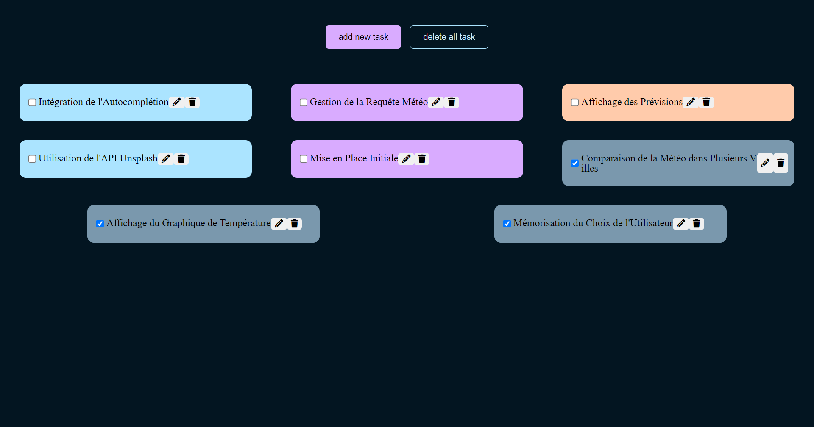

# ToDoList
***
Le projet "ToDo list" a pour objectif de créer une application web permettant à l'utilisateur de créer, checker et suprimer des tâches à faire. 

## Table des matières
1. [Utilisation](#utilisation)
2. [Technologies](#technologies)
3. [Captures d'écran](#captures-décran)
4. [Améliorations futures](#ameliorations-futures)

### Utilisation
***
Pour utiliser l'application, suivez ces étapes :

1. Allez sur la page [ToDoList](https://tess-mltx.github.io/ToDoList/).
2. Cliquez sur le button "add new task" et noter la tâche.
3. **Cliquer sur "add task"**.
4. Effectuez et validez et suprimez vos tâche.
5. Au rafraichissement de la page, les tâches se consserventront.

### Captures d'écran
***

## Technologies
***
Liste des technologies utilisées dans le projet :
* Cette application est réalisée en Vanilla JS

## Améliorations futures
***
* Corriger la submition de task avec la touche ENTER (ne fonctionne pas actuellement).
* Ajouter une fonctionnalité pour suprimer toutes les tâches réalisées. 
* Améliorer le design.
